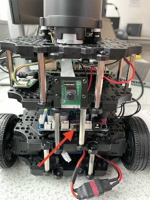

# Project Overview

The project aimed to enable a robot to navigate and interact intelligently within a simulated environment, achieving tasks such as safe zone entry, random walking exploration, window detection, planetary identification, and image stitching.

We designed the ROS architecture for seamless interaction between various ROS nodes, ensuring efficient communication and control. Implementing goal-oriented navigation using the NavigateToPose service enhanced the robot's ability to reach specific coordinates accurately. For safe zone entry, we developed algorithms that allowed the robot to identify and enter the correct zone based on color markers, optimizing navigation efficiency by prioritizing the closest location and ensuring safety.

Our exploration strategy included implementing a random walking algorithm for autonomous exploration within unknown environments. This approach improved the robot's ability to detect windows in real-time while conserving computational resources. We employed advanced image processing techniques, such as edge detection, contour filtering, and perspective transformation, for robust window detection. Furthermore, we integrated a deep learning model (Faster R-CNN with ResNet-50) for accurate planetary identification within detected windows.

To create panoramic images, we utilized OpenCV’s Stitcher class to stitch together multiple images of celestial bodies. We also calculated distances between objects using geometric and photogrammetric techniques, providing accurate measurements within the robot's environment. During real-world testing, we adapted the system for application on a physical robot, addressing challenges like color detection thresholds and command execution delays due to network congestion. After necessary adjustments, the robot performed comparably to the simulation.

The image depicts a Raspberry Pi 4 setup with a Raspberry Pi Camera Module 3 mounted on a TurtleBot3 robot. The camera is centrally positioned and secured to the robot's frame using metal brackets, allowing it to capture a clear view of its surroundings.

## Model and Training Script

Our project utilizes a Faster R-CNN model with a ResNet50 backbone for detecting various celestial bodies in images. The training script, `train.py`, is specifically designed for this task.

## Image Dimension Assumption

The `train.py` script assumes all training images are 256 pixels in width and 144 pixels in height, and the object is always located in the near-centre of the image.

## Training Environment

Training this model effectively without a CUDA-enabled GPU might pose challenges. For those lacking suitable hardware, Google Colab is recommended as it is already configured for our training needs.

## Training Duration

For accurate differentiation between closely related classes, such as Mercury and the Moon, it is advisable to increase the number of training epochs. This helps the model in learning finer distinctions.

## Model Access

Due to GitHub's file size restriction of 100MB, the trained model is hosted externally. You can download it using [this link](https://drive.google.com/file/d/1hWsvUoG82yvRbd0EhVfHnu5zrqpsoR9u/view?usp=sharing). Ensure to integrate it with your local setup for further use.

## Detailed Project Report

For a detailed project report, including design, implementation, results, and observations, please refer to [this document](https://drive.google.com/file/d/1Obq77M9mY-3xabmNVoIFxbl7UOW_NtIe/view?usp=sharing).

## Model Export and GitHub Limitations

Encountering GitHub's file size limit might require employing model compression techniques or exploring transfer learning with a simpler backbone model for easier sharing and deployment.

## Integration with ROS

The aim is to integrate our model with ROS (Robot Operating System) for inferencing purposes. Code from the `process_image` function within `demo_app/app.py` could be essential for this. Assistance from those familiar with ROS in adapting and testing this functionality is encouraged.

## Next Steps

- Review the model and training script.
- Adjust training parameters and the number of epochs as necessary to enhance class differentiation.
- Explore options for efficient and accurate inferencing by integrating the model into our ROS setup.
